Svaki do AWS resursa koje kreirate pored taga `Name` mora sadrzavati i tagove `CreatedBy: Ime Prezime` i `Email:vas@email.com`

**NOTE: Ako nije explicitno navedeno AWS Account Owners / IAM User 1 / IAM User 2 / IAM User 3 zadatak se odnosi na sviju.**

- [ x ] AWS Account Owners / IAM User 1 azurirajte permsije za IAM 2
  User-a na nacin da cete ga dodati u grupu Administrators
- [ x ] Kreirajte AMI image od instance ec2-ime-prezime-web-server, AMI
  image nazovite ami-ime-prezime-web-server
- [ x ] Kreirajte Application Load Balancer pod nazivom alb-web-servers
  koji ce da bude povezan sa Target Group tg-web-servers
- [ x ] Kreirajte Auto Scaling group sa MIN 2 i MAX 4 instance. Tip
  instance koji cete koristiti unutar ASG je t2.micro ili t3.micro
  gdje cete koristiti alb-web-servers Load Balancer. AutoScaling
  group bi trebala da skalira prema gore (scale-up) kad god CPU
  predje 18% i da skalira prema dole (scale-down) kad god CPU
  Utilisation padne ispod 18%
- [ x ] Voditite racuna da security grups koje budete koristili nakon sto
  zavrsite sa zadatakom dozvoljavaju namanje potrebne otvorene
  portove.
- [ x ] Kreirajte free account na draw.io ili lucidchart.com stranicama i
  napravite dijagram infrastrukture iz ovog onako kako je vi
  vidite/razumijete.
- [ x ] Pokusajte simulirati visoku dostupnost vase aplikacije na nacin
  da terminirate instance.
- [ x ] Pokusajte simulirati CPU load prateci sljedeci tutorijal

**Rješenje taska:**

1. IAM User 2 dodan u grupu `Administrators`
   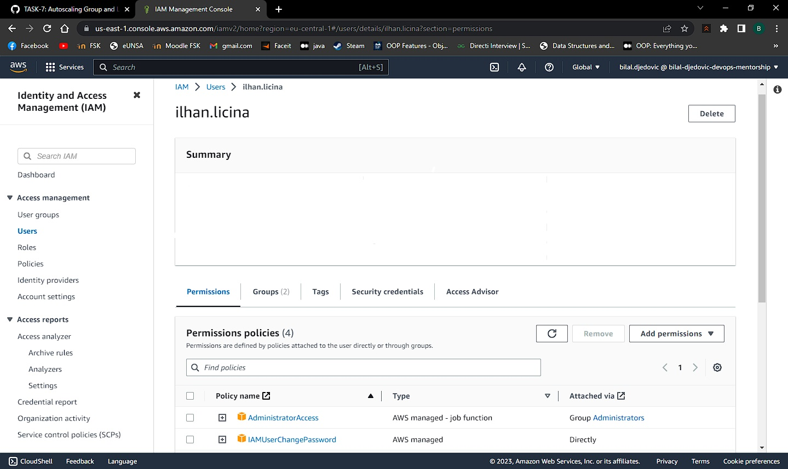
2. Kreiran AMI image `ami-bilal-djedovic-web-server` od instance `ec2-bilal-djedovic-web-server`
   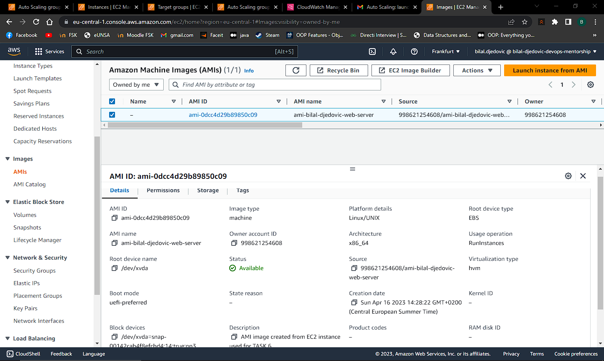
3. Kreiran Application Load Balancer pod nazivom `alb-web-servers` i povezan sa Target Group `tg-web-servers`

**_APPLICATION LOAD BALANCER:_**
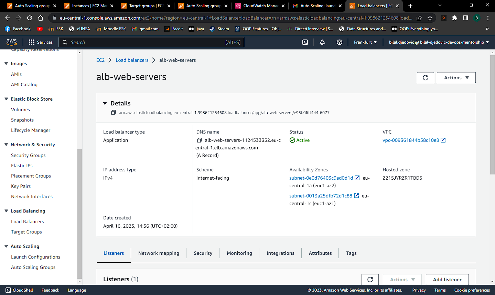

**_TARGET GROUP:_**
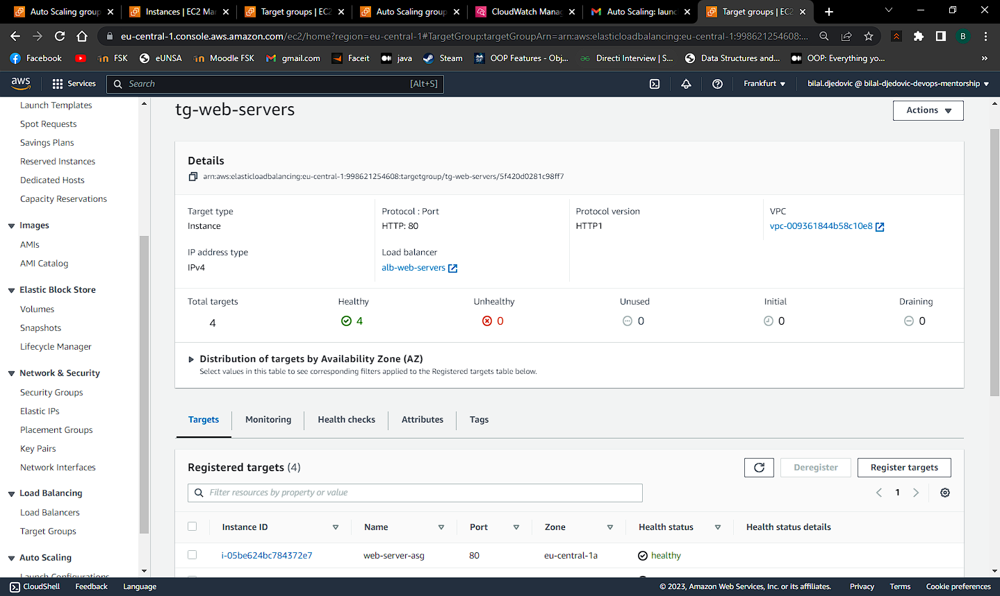

**_ALB DNS RECORD:_**
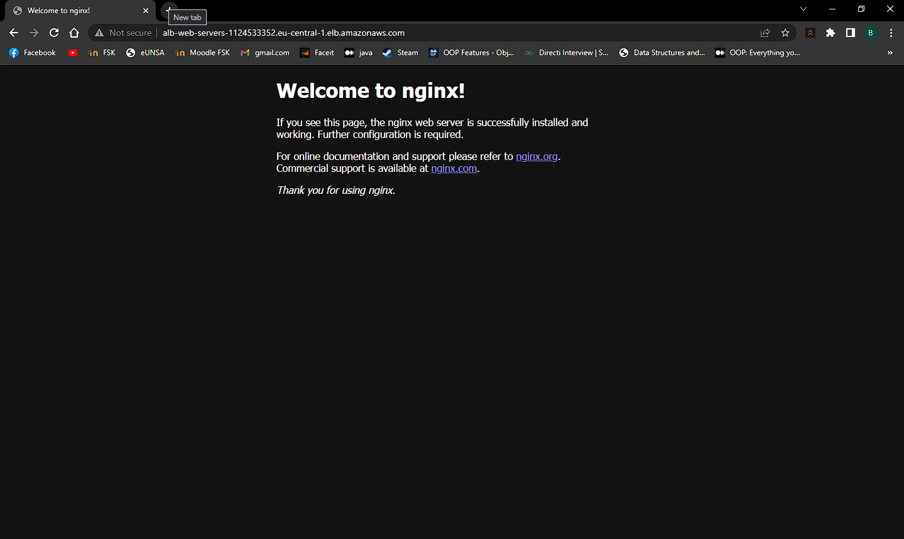

[ALB DNS RECORD](http://alb-web-servers-1124533352.eu-central-1.elb.amazonaws.com/)

4. Kreirana Auto Scaling Group pod nazivom `asg-web-servers` sa MIN 2, MAX 4 i Desired Capacity 3 instance.

**_AUTO SCALING GROUP:_**
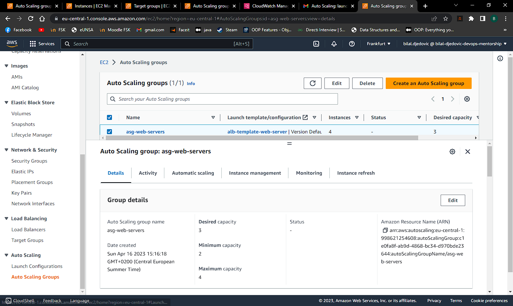
**_AUTO SCALING GROUP SNS ACTIVITY:_**
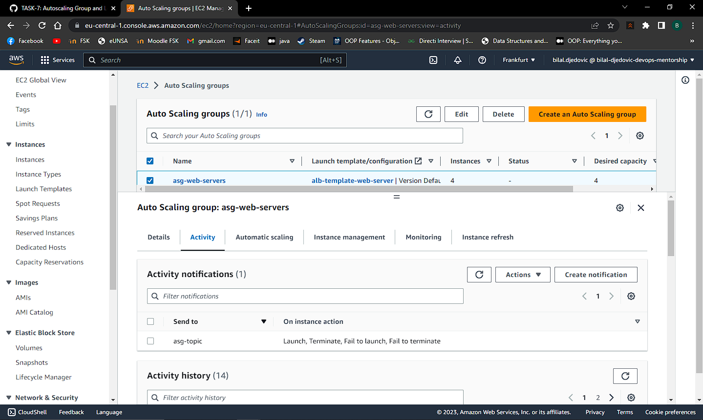
**_AUTO SCALING GROUP TARGET TRACKING POLICY:_**
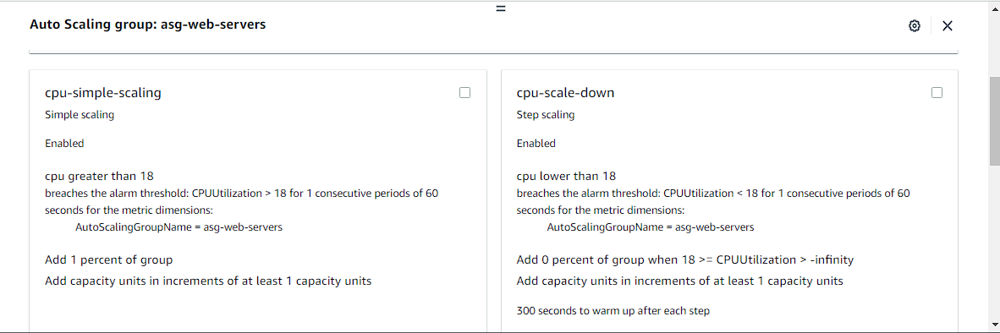

5. Simuliranje CPU loada

**_Terminal stress:_**
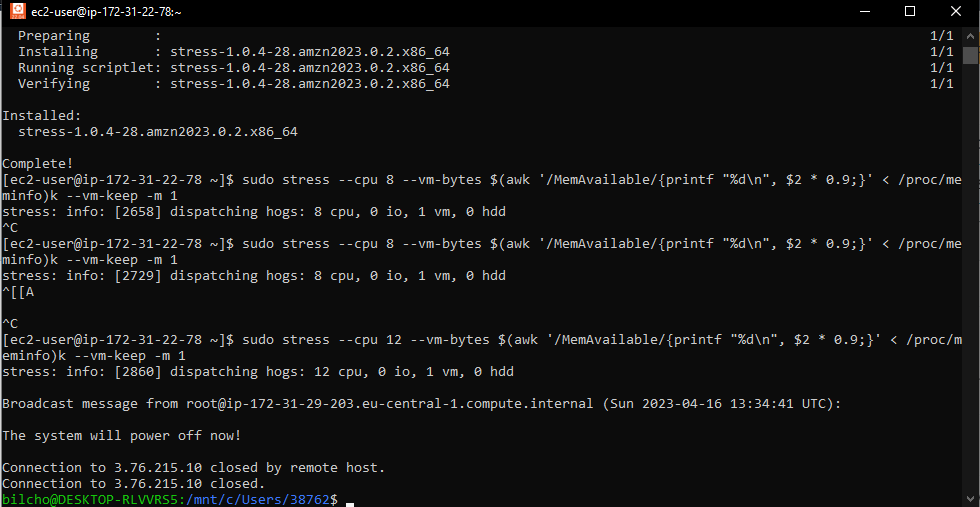
**_CloudWatch:_**
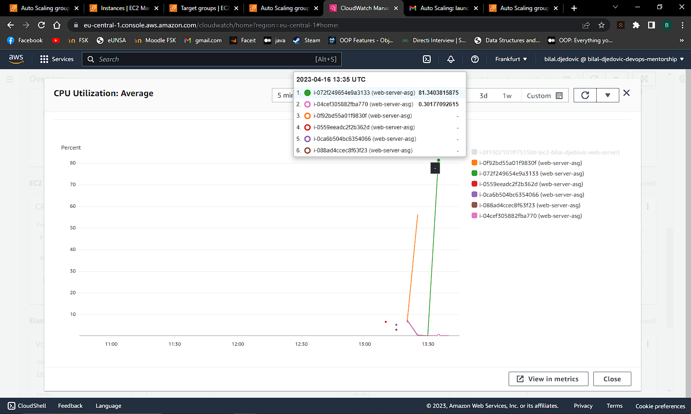
**_ASG CPU STRESS ACTIVITY_**
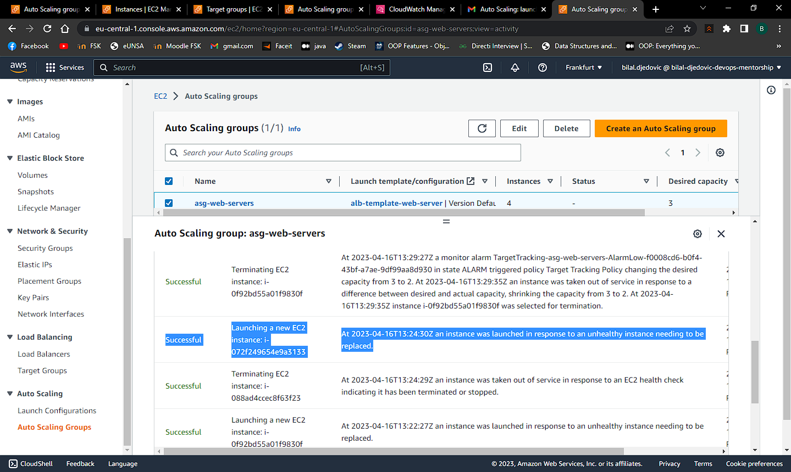
**_SNS TOPIC FOR TERMINATIG INSTANCE ON STRESS_**
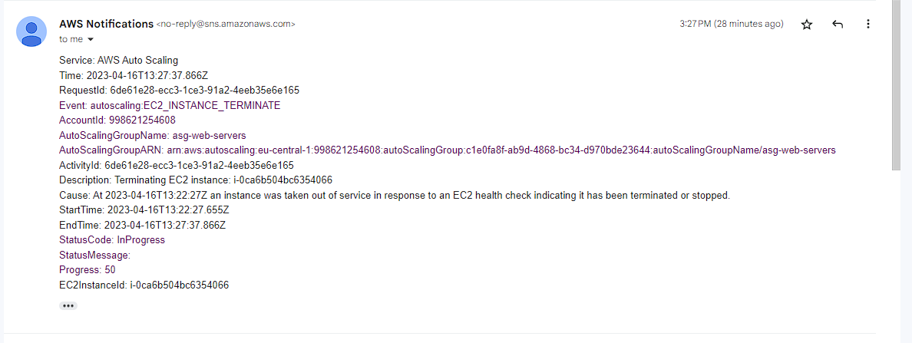

6. Dijagram infrastrukture

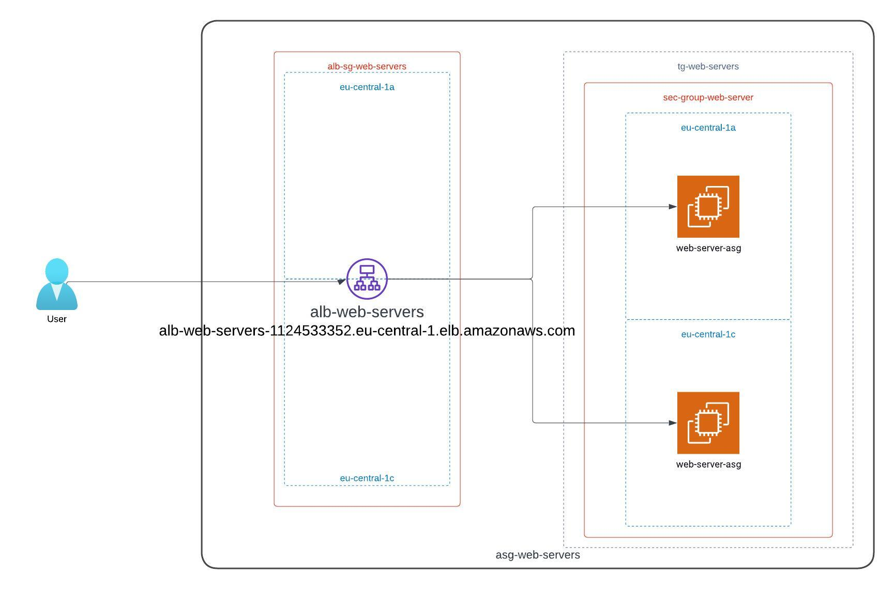
