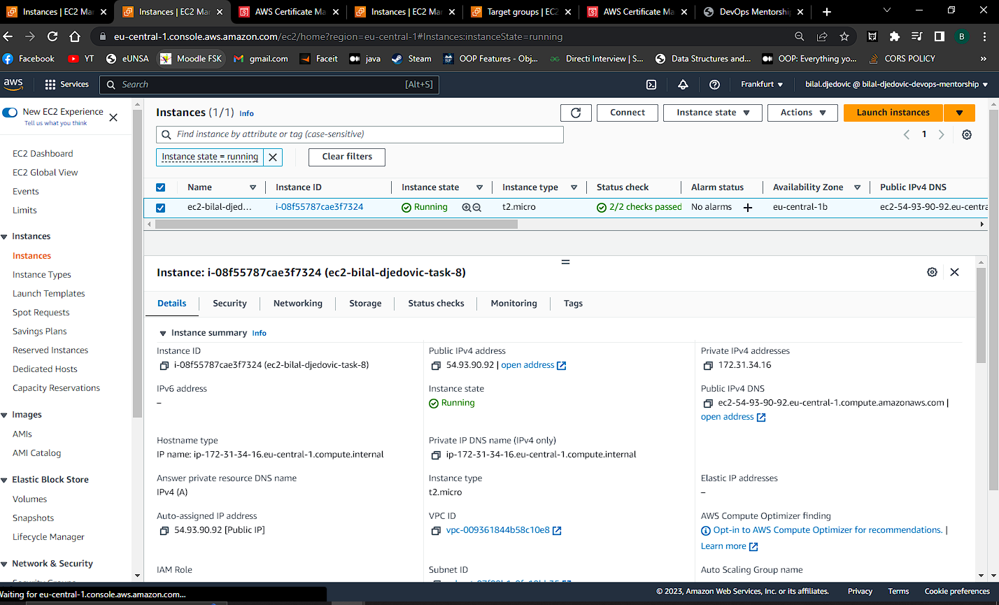
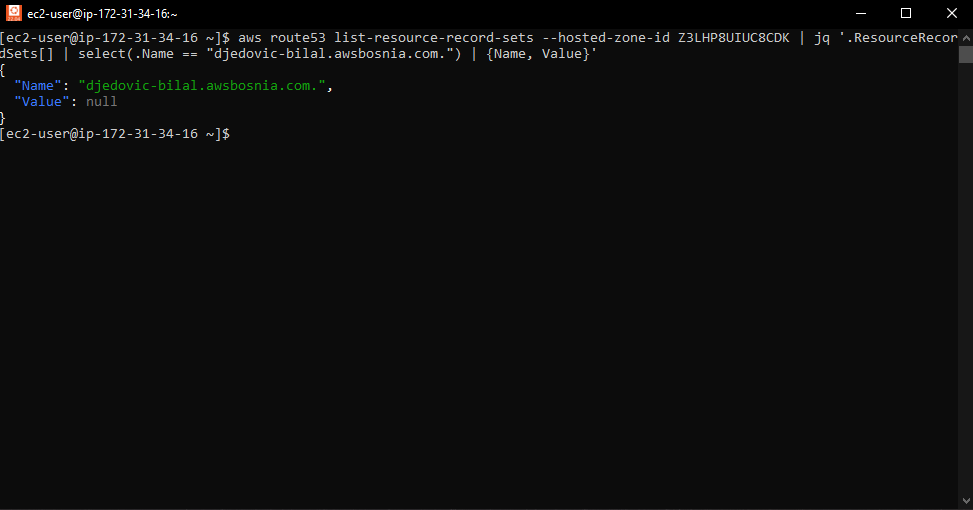
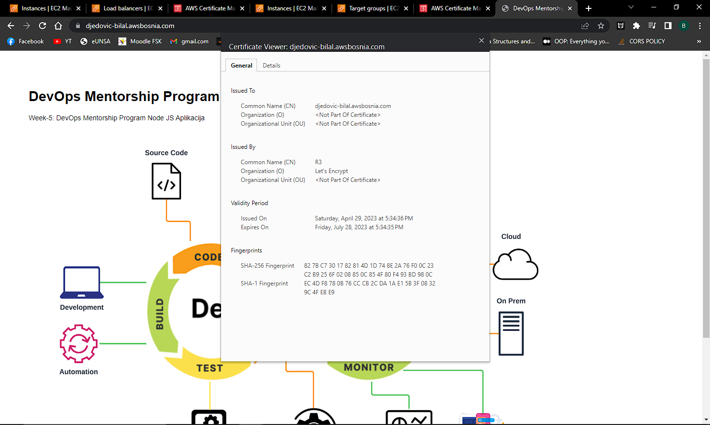
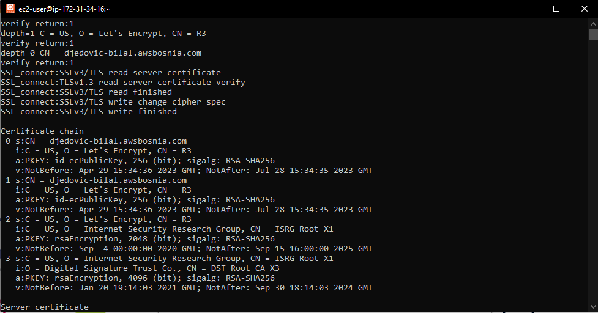
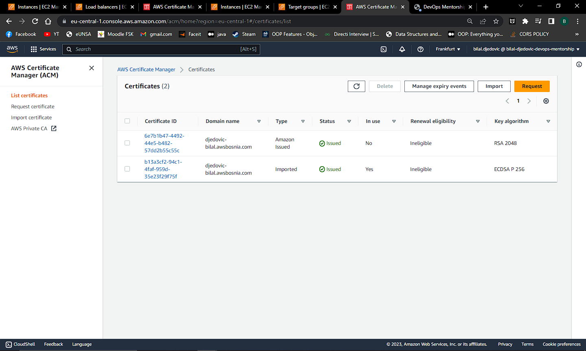
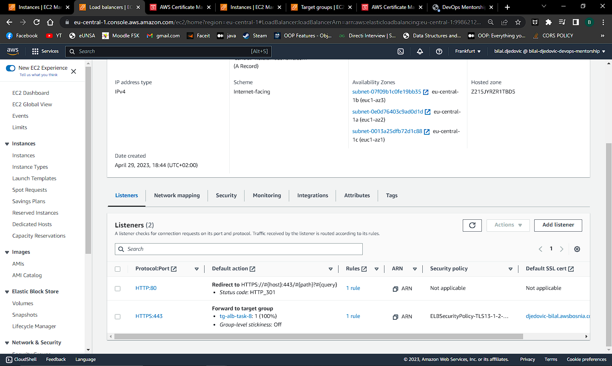
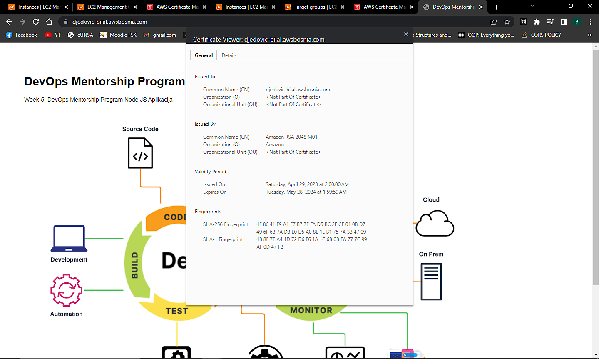
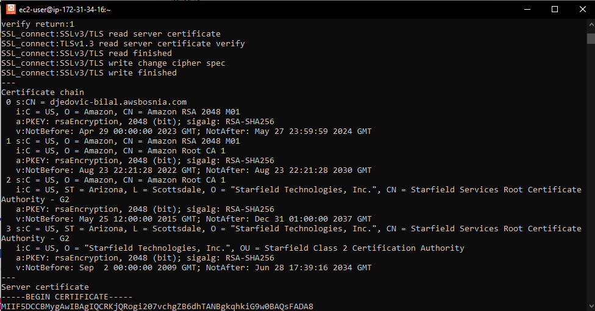
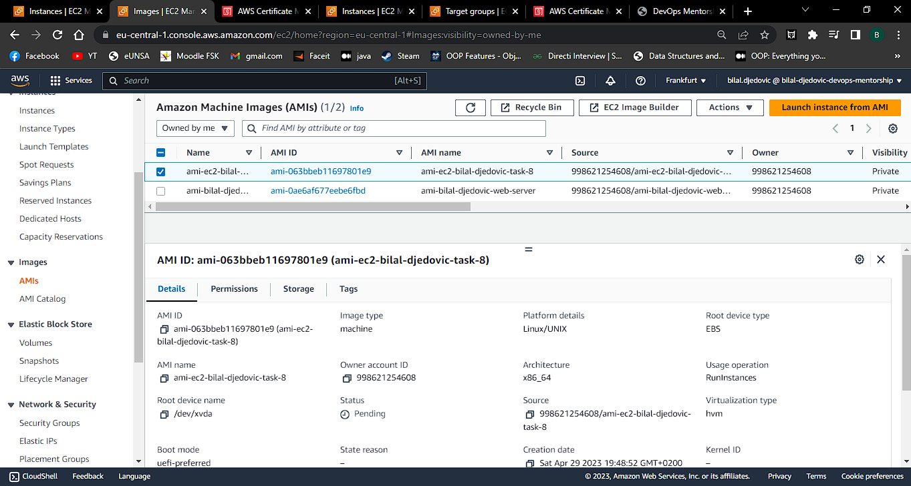

- Od AMI image `ec2-bilal-djedovic-web-server` napravio sam novu EC2 instancu `ec2-bilal-djedovic-task-8`

  

- Kreirao sam DNS record `djedovic-bilal.awsbosnia.com` za Hosted Zone awsbosnia.com (`Hosted zone ID: Z3LHP8UIUC8CDK`) koji ce da pokazuje na EC2 instancu.

Koristio sam komandu te sam konfigurisao profil uz pomoć dostavljenog excel filea

    aws configure
    aws route53 change-resource-record-sets --hosted-zone-id Z3LHP8UIUC8CDK --change-batch '{"Changes":[{"Action":"CREATE","ResourceRecordSet":{"Name":"djedovic-bilal.awsbosnia.com.","Type":"A","TTL":60,"ResourceRecords":[{"Value":"54.93.90.92"}]}}]}'
    aws route53 list-resource-record-sets --hosted-zone-id Z3LHP8UIUC8CDK | jq '.ResourceRecordSets[] | select(.Name == "djedovic-bilal.awsbosnia.com.") | {Name, Value}'`

- Na EC2 instanci `ec2-bilal-djedovic-task-8` kreirao Let's Encrypt SSL certifikat domenu.
- Omogucio autorenewal SSL certifikata

`sudo dnf install python3 augeas-libs -y`
`sudo python3 -m venv /opt/certbot/`  
`sudo /opt/certbot/bin/pip install --upgrade pip`
`sudo /opt/certbot/bin/pip install certbot certbot-nginx`
`sudo ln -s /opt/certbot/bin/certbot /usr/bin/certbot`  
`sudo certbot certonly --nginx`  
`echo "0 0,12 * * * root /opt/certbot/bin/python -c 'import random; import time; time.sleep(random.random() * 3600)' && sudo certbot renew -q" | sudo tee -a /etc/crontab > /dev/null`

- Koristeci openssl komande prikazao koji SSL certitikat koristim i datum njegovog isteka.

`sudo openssl s_client -servername djedovic-bilal.awsbosnia.com -connect djedovic-bilal.awsbosnia.com:443 -state`

- Importovao Lets Encrypt SSL certifikat unutar AWS Certified Managera.

  

- Kreirao sam Load Balancer te sam postavio importovani SSL certifikat.
  
- Koristeci openssl komande prikazao sam koji SSL certitikat koristim za domenu i datum njegovog isteka.
  
- Koristeci openssl komande prikazao sam da koristim AWS certifikat.
  

- Kreirao sam AMI image `ami-bilal-djedovic-task-8`.

