[TASK-9: Static website with S3 and CloudFront](https://github.com/allops-solutions/devops-aws-mentorship-program/issues/63)

- S3 website endpoint - non-encrypted: http://bilal-djedovic-devops-mentorship-program-week-11.s3-website.eu-central-1.amazonaws.com/
- Distrubtion endpoint - encrypted: https://d2hzrdxvi2av2x.cloudfront.net/
- R53 record - encrypted: https://www.bilal-djedovic.awsbosnia.com/

**S3 BUCKET:**

S3 Bucket files:

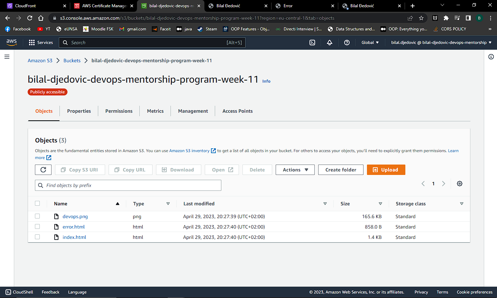

S3 Bucket Static Website:

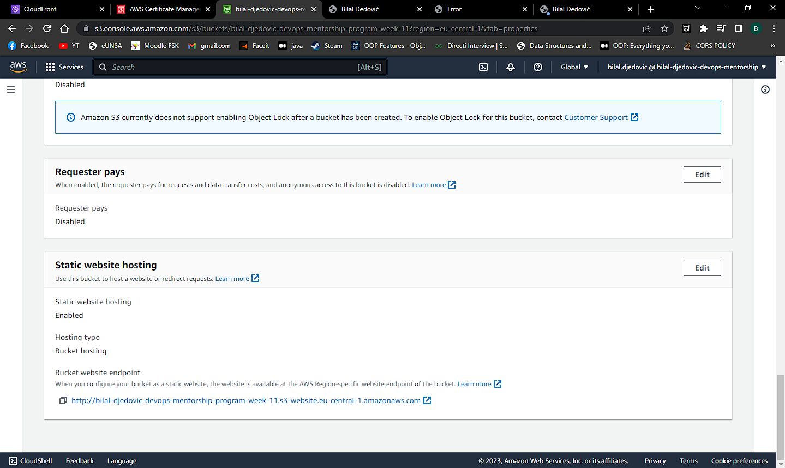

S3 Bucket endpoint:

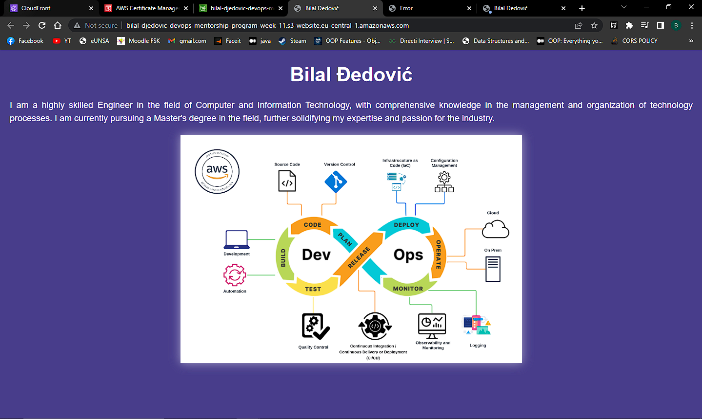

S3 Bucket Policy:

    {
    "Version": "2012-10-17",
    "Statement": [
        {
            "Sid": "PublicReadGetObject",
            "Effect": "Allow",
            "Principal": "*",
            "Action": "s3:GetObject",
            "Resource": "arn:aws:s3:::bilal-djedovic-devops-mentorship-program-week-11/*"
        }
    ]
    }

ACM Certificate in us-east-1:

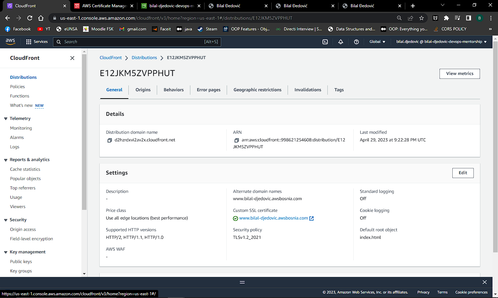

CloudFront distribution:

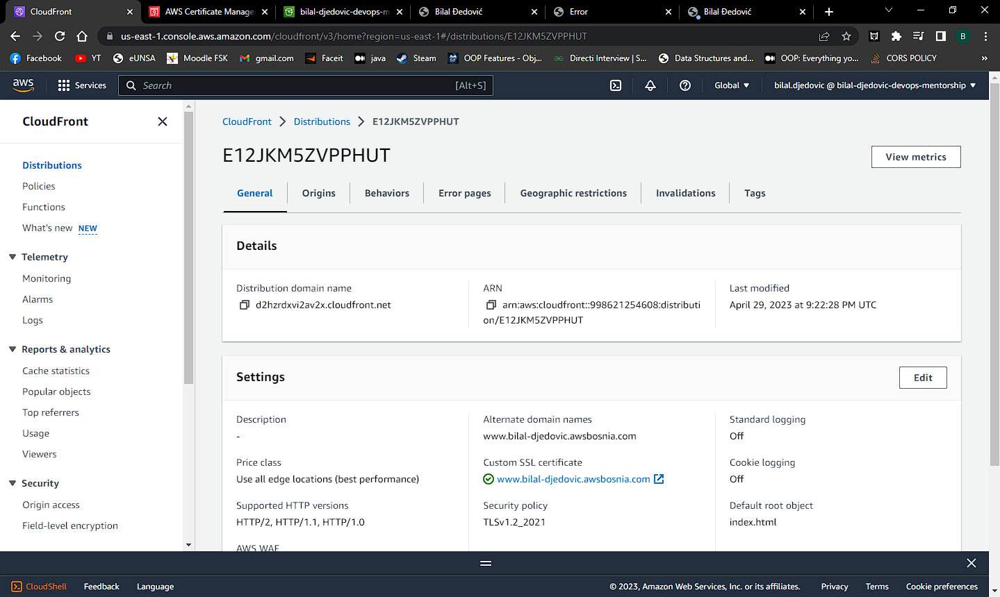

CloudFront distribution Origins:

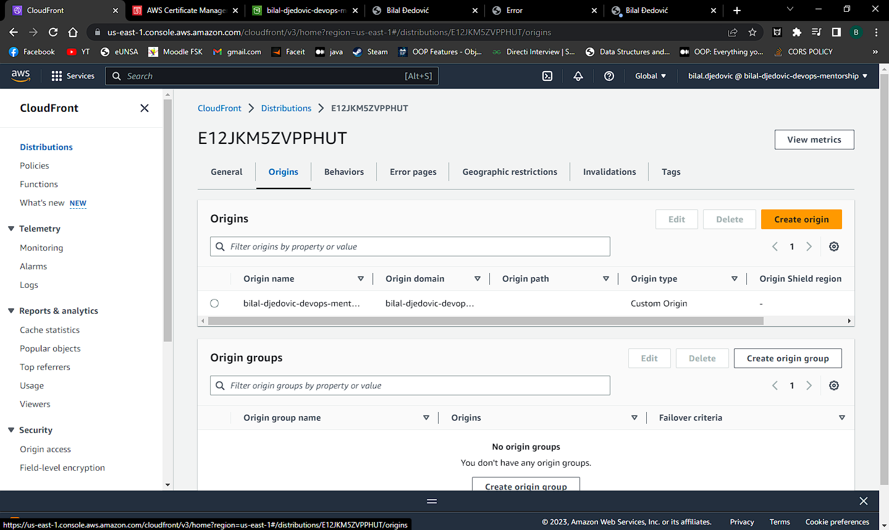

CloudFront distribution Behaviors:

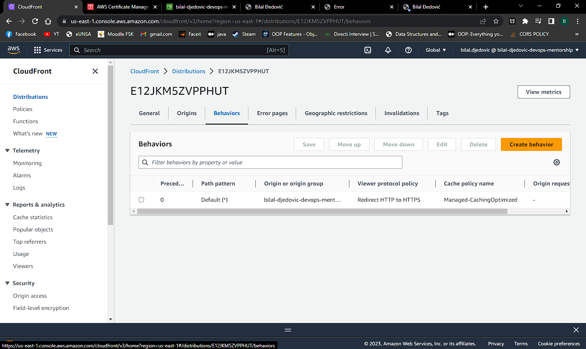

CloudFront distribution index.html:

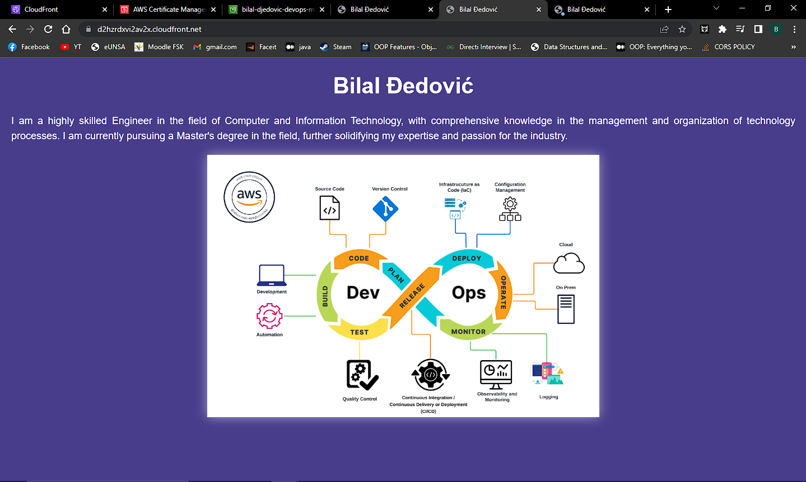

CloudFront distribution error.html:

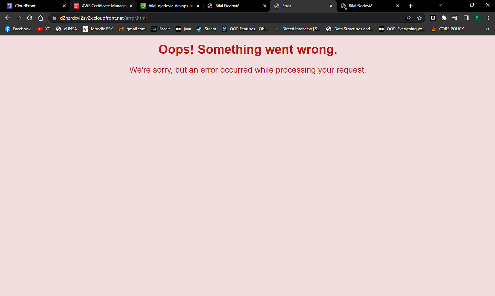

CloudFront distribution encrypted:

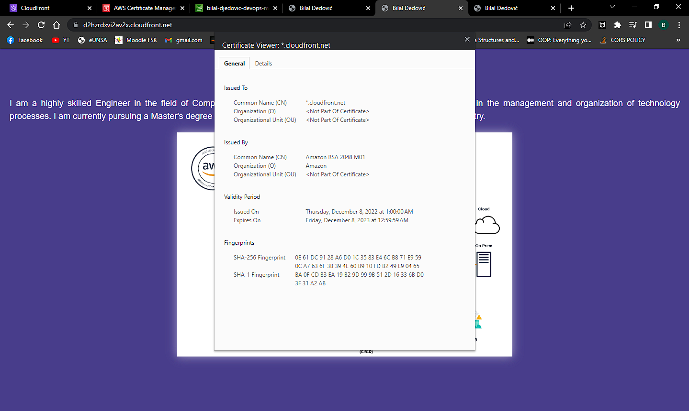

R53 record:

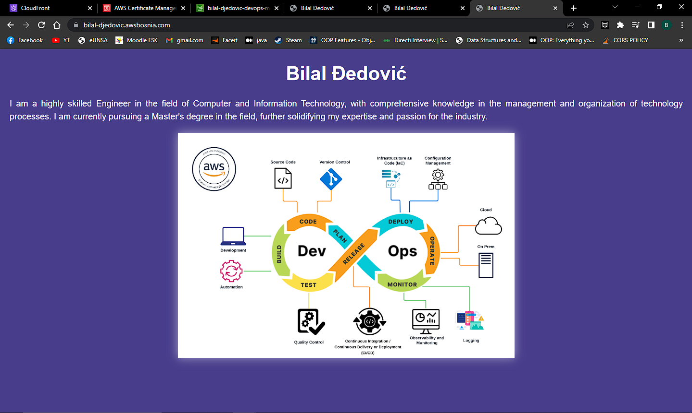

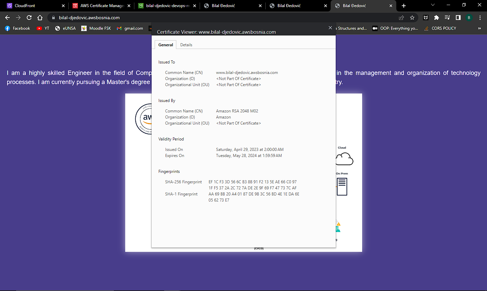

Komande korištene:

```
aws route53 change-resource-record-sets --hosted-zone-id Z3LHP8UIUC8CDK --change-batch '{"Changes":[{"Action":"CREATE","ResourceRecordSet":{"Name":"_806e56829bf740b00d4d76cf6ae86a89.www.bilal-djedovic.awsbosnia.com.","Type":"CNAME","TTL":60,"ResourceRecords":[{"Value":"_f7a0128314993370a3548a2163ca58e8.fpgkgnzppq.acm-validations.aws."}]}}]}' `

aws route53 change-resource-record-sets --hosted-zone-id Z3LHP8UIUC8CDK --change-batch '{"Changes":[{"Action":"CREATE","ResourceRecordSet":{"Name":"www.bilal-djedovic.awsbosnia.com","Type":"CNAME","TTL":60,"ResourceRecords":[{"Value":"d2hzrdxvi2av2x.cloudfront.net"}]}}]}'

aws route53 list-resource-record-sets --hosted-zone-id Z3LHP8UIUC8CDK | jq '.ResourceRecordSets[] | select(.Name == "www.bilal-djedovic.awsbosnia.com.") | {Name, Value}'
```

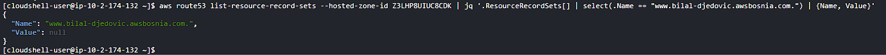
